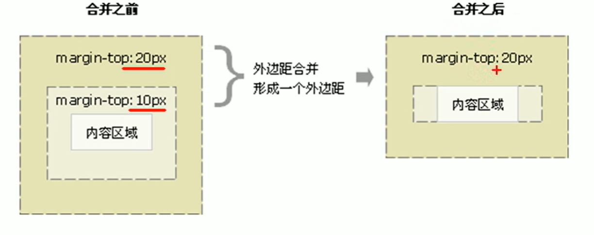

# 盒子模型

## 边框

```css
div {
  border: border-width || border-style || border-color;
}
```
- 边框合并

```css
div {
  border-collapse: collapse;
}
```


@import "t00.html" {title: "基本示例"}
@import "t01.html" {title: "边框合并"}
@import "t02.html" {title: "边框会影响盒子实际大小"}

```txt
```
```txt
```


## 内边距


@import "t03.html" {title: "基本示例"}
@import "t04.html" {title: "复合写法"}
@import "t05.html" {title: "影响盒子大小"}
@import "t06.html" {title: "不撑开盒子情况"}

```txt
```
```txt
```


## 外边距

 水平居中条件

  1.盒子必须指定宽度 2.左右外边距设置未 auto

* 外边距合并

  1.当子父盒子都有上外边距，父元素会塌陷较大外边距值
  

解决方案： 1.父元素定义上边框 2.父元素定义上内边距 3.父元素添加 overflow:hidden


@import "t07.html" {title: "基本示例"}
@import "t08.html" {title: "外边距合并-相邻块"}
@import "t09.html" {title: "外边距合并-嵌套块"}

```txt
```
```txt
```


## 清除内外边距


@import "t10.html"

```txt
```
```txt
```


## 居中示例


@import "tauto_block.html" {title: "块元素居中"}
@import "tauto_other.html" {title: "行内或行内块元素居中"}

```txt
```
```txt
```


## 示例


@import "tSina.html" {title: "新浪导航"}
@import "tXiaomi.html" {title: "小米侧边栏"}
@import "tall.html" {title: "综合示例"}
@import "tWeb_display.html" {title: "常见网页布局"}

```txt
```
```txt
```



